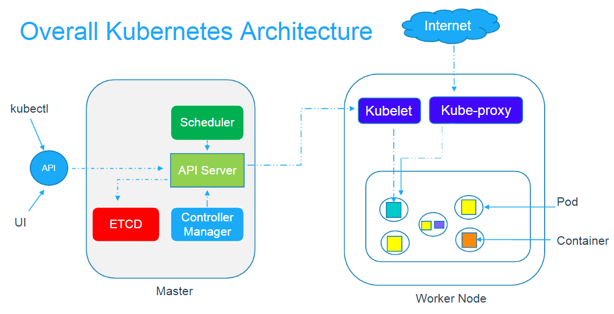

# Azure Kubernetes Service (AKS)

So far, we have been using minikube to host our Kubernetes clusters, and that's great during development and testing. However, when it comes to production, we need a cloud-based, scalable, and highly available solution. Implementing this out of scratch on our own server would be very challenging, and make little sense, which is why all major cloud providers have an implementation that allows you to run your Kubernetes cluster on the cloud. AKS helps achieve this to some degree.

## What is AKS?

To start understanding exactly what AKS is, let's backtrack to the beginning. If you've forgotten the Kubernetes architecture, perhaps this is a good time to revisit [the lesson](https://collabnix.github.io/kubelabs/Kubernetes_Intro_slides-1/Kubernetes_Intro_slides-1.html).

Consider the following architecture, which is how Kubernetes works:

You have the master node which handles and provisions worker nodes, which do the actual work of holding pods. Previously, when we used minikube, we ran everything on our local machine. However, now, we can move part of this to AKS. One thing to note is that AKS does not act as an alternative to the entire Kubernetes architecture, rather, it only replaces the master node. As such, AKS is free and only requires a normal Azure subscription. The processes which take place within the master node would be invisible to you, and you should not really care as to what goes on in the background. Instead, you only have to think about the service it provides, and how your worker nodes would use that service. In short, AKS abstracts away anything specific to the master node, and provides a host of other features as well.

## Why use AKS?

You can reap the full benefits of AKS if the rest of your application, or your organization uses Azure cloud as their main cloud platform. The master node, which is handled by AKS allow you to upgrade your cluster with minimal hassle, allows seamless integration with other Azure services. Azure policies that you may have defined can be applied across clusters, and AKS handles provisioning and scaling with autoscaler integrations which takes all the manual work away from your. If you use Azure Container Instances (ACI), then you can schedule your containers in conjuction with AKS.

A major part of AKS is it's ability to network, so we'll be taking a look at that in the next lesson.

[Next: AKS Networking]()