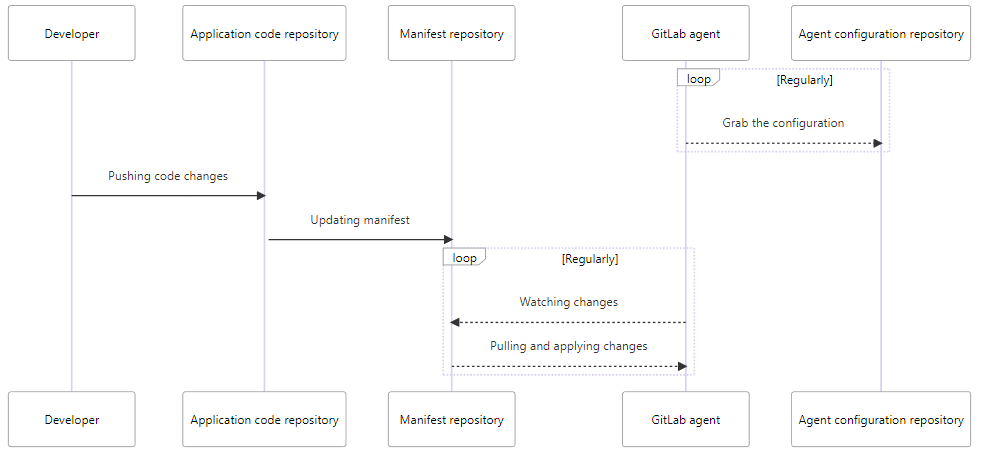

## Lab

To start off, you need a Kubernetes cluster. If you already have a cluster running on a VM or on the cloud, you can use that. If not, the use of [GKE](https://cloud.google.com/kubernetes-engine/docs/deploy-app-cluster) is recommended. GitLab has partnered with GKE to offer $200 of credit in addition to the $300 of credit you get when you sign up in GCP. This applies even if you have an existing account with GCP, so it's a great way to get started. Otherwise, refer to the GitLab guide for setting up an agent server [here](https://docs.gitlab.com/ee/administration/clusters/kas.html).

To set up a cluster in GKE, follow the steps outlined in the [official doc](https://docs.gitlab.com/ee/user/infrastructure/clusters/connect/new_gke_cluster.html). It will take you through the steps of importing an example project, creating and registering an agent for GitLab on GKE, creating GCP credentials, project configuration, and cluster provisioning.

You also need a GitLab account and have GitLab CI/CD activated. First, before we register the agent, we have to consider why we need an agent at all. The agent is placed to provide a smoother access workflow between GitLab and your Kubernetes cluster.  So, even if your cluster is behind a firewall (which it should optimally be), GitLab can still communicate with it. It also allows GitLab to access any API endpoints that the cluster may have, as well as work in the opposite direction by having GitLab push events to the cluster in real-time.

First, take note of the sidebar to your left. This sidebar has the full set of options that GitLab makes available to you. Feel free to browse through them and get a grasp of where all the features we mentioned above can be found. What we are looking for now is the infrastructure section that will lead to the section for Kubernetes clusters. You should be able to connect your Kubernetes cluster from here. If you followed the GKE guide from above, you should be able to simply select the Kubernetes agent running there from the dropdown. Doing this will get you a token, which you need to store securely. You will also note that there is a section called "Recommended Installation method", which has a command placed under it. Copy this command, we will be using it next.

Now, you need to install the agent on your cluster. For this, we will be using [Helm](../Helm101/what-is-helm.md). Helm allows you to install multiple packages together so that you don't have to install each thing manually. Go to GKE and [get your kubeconfig](https://cloud.google.com/kubernetes-engine/docs/how-to/cluster-access-for-kubectl#view_kubeconfig). Then [set your kubeconfig](https://kubernetes.io/docs/concepts/configuration/organize-cluster-access-kubeconfig/) so that your local machine has access to your GKE cluster. Now, open a terminal instance, make sure you can access your GKE cluster from it, and run the command that we copied in the previous step.

When you do this, a new namespace, a service account with admin access, a secret for the agents' access token, and a deployment resource for the agent's pod are created. If you wish to customize any of these things, you may do so by changing the Helm charts' yaml. These are the resources created by default. If you are planning to change anything, it's best if you took a look at the [full list of customizable items](https://gitlab.com/gitlab-org/charts/gitlab-agent/-/blob/main/values.yaml) in the values.yaml.

Excellent, now you've finished setting up the GitLab agent on your Kubernetes cluster. This means that you are done.

We have covered [GitOps](../GitOps101/what-is-gitops.md) before. In that case, we used ArgoCD as the primary example. Now, we will be using the same GitOps workflow, but with GitLab. Of course, you could connect ArgoCD to your GitLab repo and have it update your Kubernetes cluster automatically. For that, look at the previous [ArgoCD section](../GitOps101/argocd.md). However, this time instead of repeating ourselves, let's go ahead and create our own workflow. Similar to ArgoCD, you will be keeping your Kubernetes manifest files in your GitLab repo. Remember that one of the advantages of having a GitLab agent in your k8 cluster is that GitLab can push changes to the cluster in real-time. We will be using this to our advantage by having changes that are pushed to the resource files in the repo get automatically pushed to your Kubernetes cluster.

This is a general overview of the GitOps architecture that you just set up:

Let us look at the diagram in a little more detail. We see that the developer pushes changes to the repository, and the changes in the manifest files get updated. The GitLab agent running on your Kubernetes cluster identifies that there have been changes (by continuously watching for and pulling changes), and updates the resources in your cluster. As you can see, it is very similar to how ArgoCD works, with the GitLab agent doing most of the work ArgoCD would have. 

Although you are done with setting up GitLab to work with GitOps, there are a whole lot of things you can look into and customize. You can change the [GitOps configuration reference](https://docs.gitlab.com/ee/user/clusters/agent/gitops.html#gitops-configuration-reference), manage [GitOps annotations](https://docs.gitlab.com/ee/user/clusters/agent/gitops.html#gitops-annotations) or see any [troubleshooting options](https://docs.gitlab.com/ee/user/clusters/agent/gitops.html#troubleshooting) you may have.